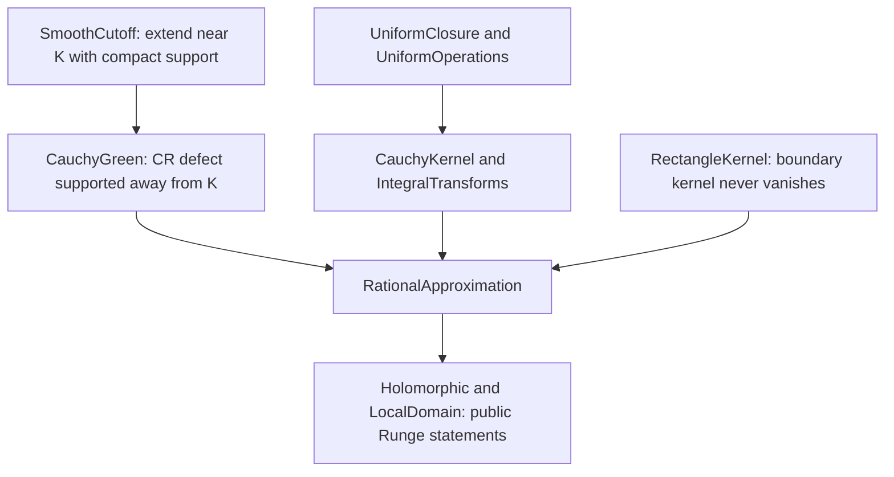
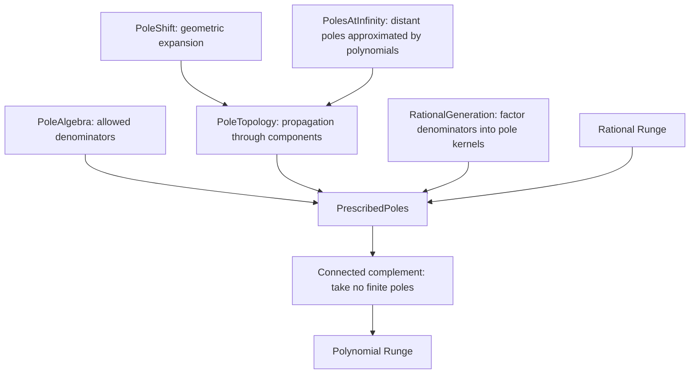
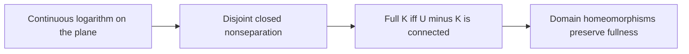
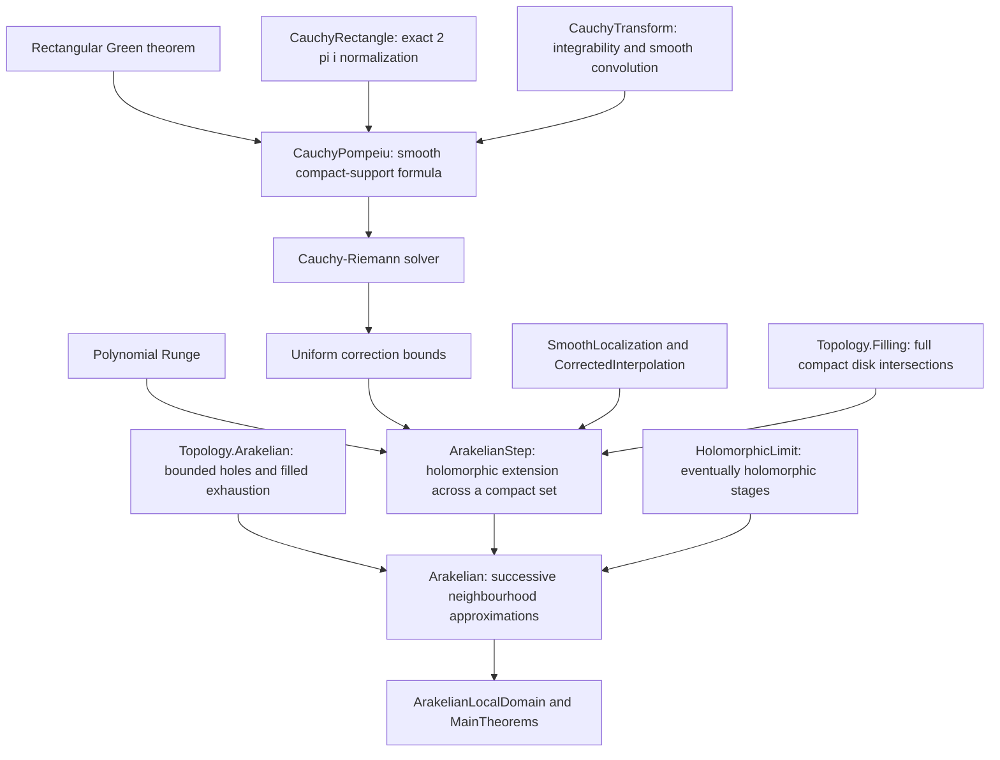
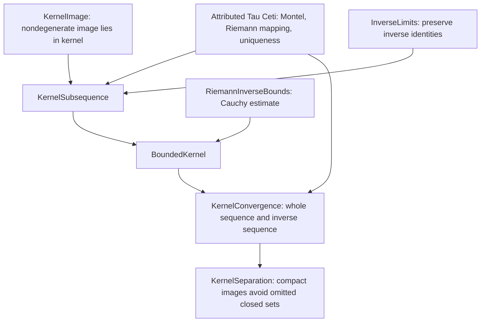

# Proof map

[Main statements](MAIN_RESULTS.md) · [Classical results](CLASSICAL_RESULTS.md) · [Complete module index](docs/MODULE_INDEX.md)

Arrows below indicate the main mathematical route. The
[generated import graph](docs/import-graph.json) records exact direct imports,
including convenience imports, rather than minimal theorem dependencies.

## Rational approximation

The cutoff agrees with the original function near $K$. The rectangular
Green identity expresses its values using Cauchy kernels and the CR defect.
The integrals lie in the uniform rational closure in $C(K,\mathbb C)$.
The boundary factor is nonzero and its reciprocal is in that closure, so
the original function lies in the closure. This produces a single rational
approximant uniformly on all of $K$.

Read [RationalApproximation](Runge/RationalApproximation.lean), then follow
its ingredients in the [detailed proof plan](docs/PROOF_PLAN.md).
This Runge proof does not require the later smooth Cauchy–Pompeiu development.

## Prescribed poles and polynomials

A kernel is transported along each complementary component. The allowed
set supplies a pole in every bounded component; the expansion at infinity
handles unbounded components. Factorisation of denominators then gives
all rational functions. For a full compact set there are no bounded holes,
so no finite poles are needed and the approximants are polynomials.

## Domain topology

These results are in
[Topology/Nonseparation](ComplexApproximation/Topology/Nonseparation.lean).
They form a separate reusable branch; Runge does not depend on this branch.
EremenkosConjecture uses its compact disjoint-union consequence when gluing
boundary data. See [the full argument](docs/FULLNESS.md).

The [statement gallery](ComplexApproximation/MainTheorems.lean) sits at the
end of the proof routes and exposes the conclusions. The original target
compatibility library is separate from the main proof library.

## Neighbourhood-holomorphic Arakelian approximation

The second cutoff localizes the correction density where the polynomial error
is small. This makes the density globally smooth without requiring a global
holomorphic extension of the original function. Summable uniform errors on
successive filled sets give an entire limit and the prescribed error on $E$.

## Conformal kernel convergence

These are completed foundations for Theorem 1.2. The decorated unbounded-domain
geometry and the general-continuum construction are now proved in EremenkosConjecture;
see its [proof map](../EremenkosConjecture/docs/THEOREM12_PLAN.md).
The Tau Ceti internals are excluded from the own-source module count and are
listed in their [upstream manifest](../FunctionTheory/third_party/TauCeti/UPSTREAM.json).

The conformal-mapping development is now maintained in
[FunctionTheory](../FunctionTheory/README.md); the corresponding modules in
this repository are compatibility wrappers. Consult its theorem gallery for
the current statements and extensions.

[FilledContinua](ComplexApproximation/Topology/FilledContinua.lean) combines
the existing filling and nonseparation APIs with Tau Ceti's bounded filled
hull. Its domain-containment result feeds the application's Jordan-neighbourhood
proof of simple connectivity.
