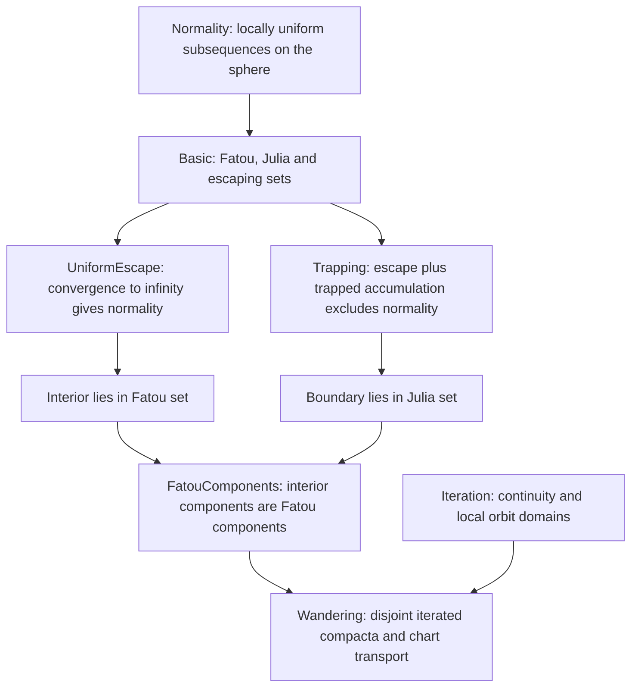

# Proof map

[Definitions and statements](MAIN_RESULTS.md) · [Classical results](CLASSICAL_RESULTS.md) · [Complete module index](docs/MODULE_INDEX.md)

The library has no dependency on the approximation or Eremenko projects.
Arrows describe the mathematical argument; exact imports are recorded in
[import-graph.json](docs/import-graph.json).

## From orbit control to wandering domains

Uniform escape gives an explicit normal limit, namely infinity. At a
boundary point, a hypothetical normal subsequence would have limit infinity
at the escaping point and a finite compact-set value at nearby trapped
points. Continuity contradicts this. The Julia boundary prevents the
interior's Fatou components from extending outside the compact set.
Disjoint forward compact images then put the forward domains in distinct
Fatou components.

The current [wandering criterion](ComplexDynamics/Wandering.lean) uses
ambient charts to transport boundaries and interiors of compact images.
This is separate from fullness preservation, which now has a local-domain
topological proof in ComplexApproximation. Replacing the entire chart
invariant with local charts is a possible later simplification.

## Other reusable routes

| Route | Modules | Used for |
| --- | --- | --- |
| Schwarz estimates → equicontinuity → Arzelà–Ascoli subsequence | [BoundedNormality](ComplexDynamics/BoundedNormality.lean) | A bounded invariant disk gives Fatou points after entry. |
| Maximum modulus → iterated radius bounds | [FastEscape](ComplexDynamics/FastEscape.lean) | Turn quantitative orbit growth into fast escape. |
| Scaling of iterates and maximum modulus | [Scaling](ComplexDynamics/Scaling.lean), [FastEscapeScaling](ComplexDynamics/FastEscapeScaling.lean) | Remove the normalisation of the constructed compact set. |
| Polynomial growth + bounded values at distant points | [Transcendence](ComplexDynamics/Transcendence.lean) | Rule out polynomial limits. |
| Small nonzero exponential perturbations | [TranscendentalApproximation](ComplexDynamics/TranscendentalApproximation.lean) | Cover eventual-empty construction data. |
| No exiting paths → equality of path components → no curve to infinity | [PathComponents](ComplexDynamics/PathComponents.lean), [CurvesToInfinity](ComplexDynamics/CurvesToInfinity.lean) | Theorem 3.4 and its curve consequence. |

Montel's full theorem, general Fatou conjugacy, and general equivalence of
fast-escape radius conventions are not proved by these routes.
