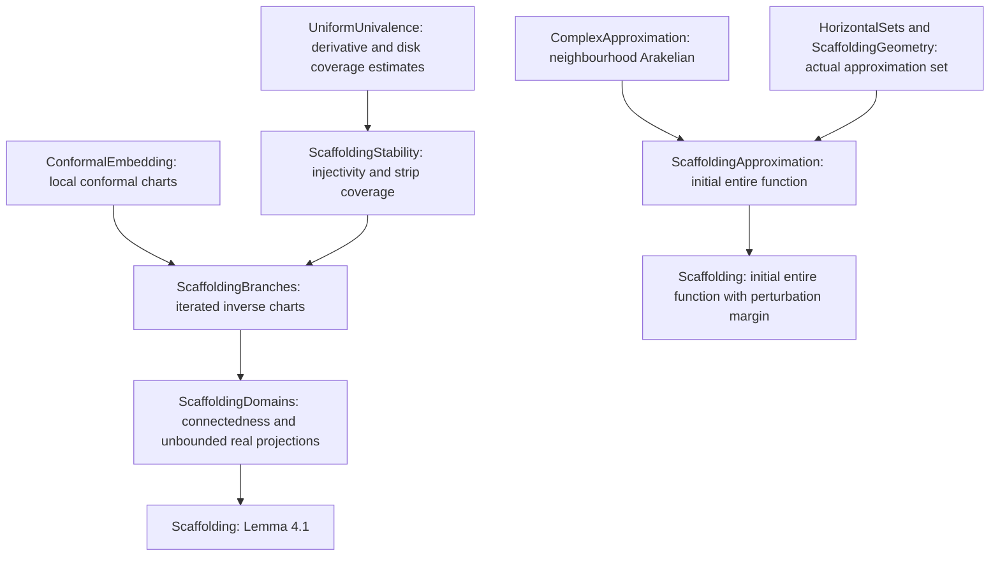
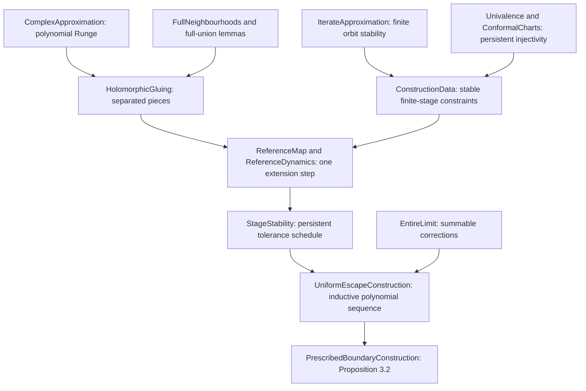
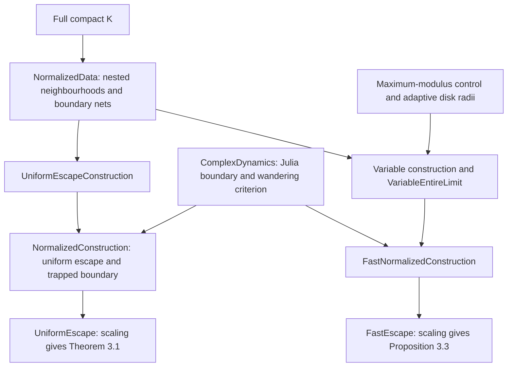
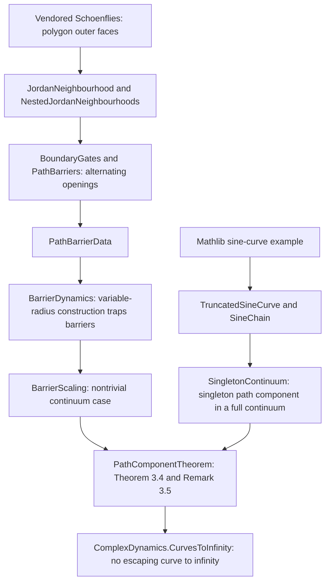
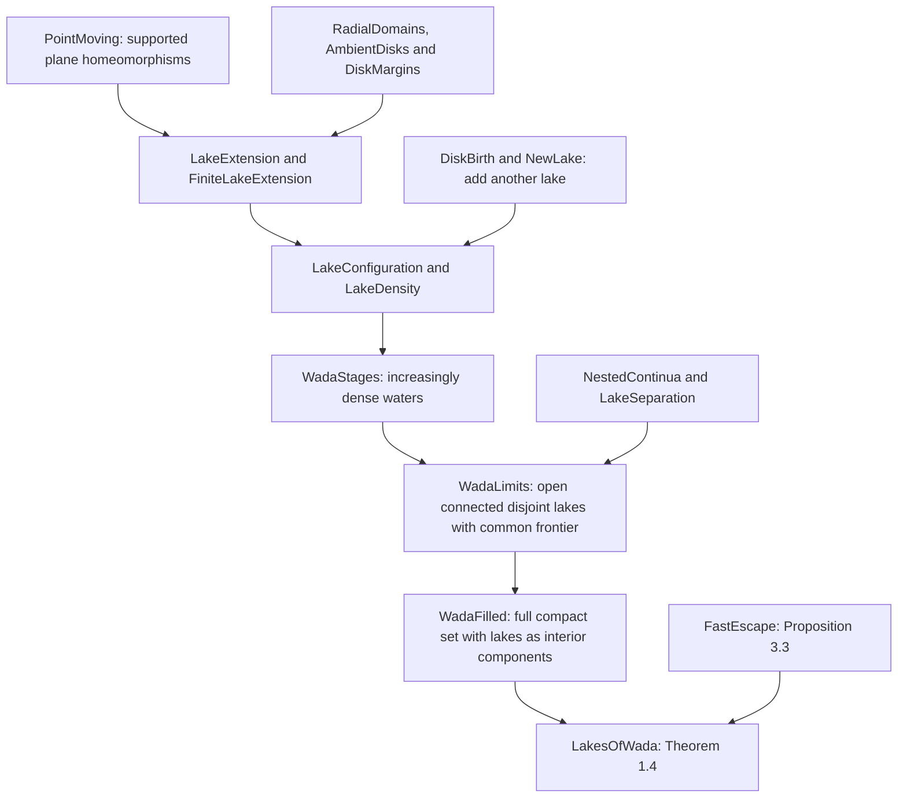
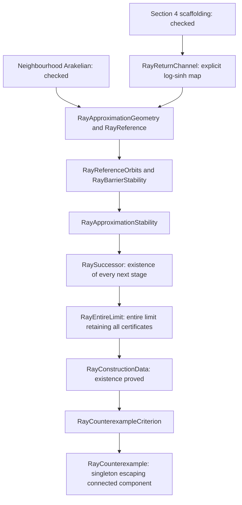
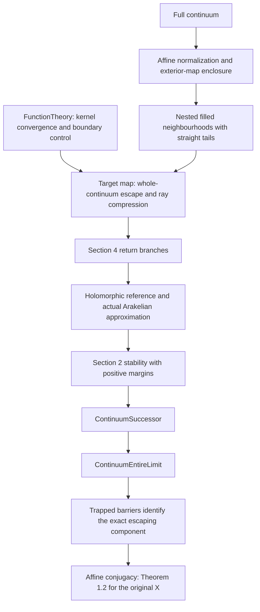

# Proof map

[Statements by paper number](MAIN_RESULTS.md) · [Auxiliary results](CLASSICAL_RESULTS.md) · [Complete module index](docs/MODULE_INDEX.md)

This page explains the proof routes. Arrows indicate mathematical inputs;
they are not claims about the smallest possible Lean dependency set.
[import-graph.json](docs/import-graph.json) records the direct imports, and
the module index lists both imports and the modules that use each file.

## Section 2 foundations and the construction engine

The completed Section 4 branch is shown below. Theorem 7.1's existence
construction is also complete; its detailed route is in the
[Section 7 map](docs/SECTION7_PROGRESS.md). The arbitrary-continuum
construction for Theorem 1.2 is also complete.

At one stage, prescribe a holomorphic map on finitely many separated compact
pieces: retain the old orbit, advance the next compact set, and send selected
boundary pieces into the trapping disk. Fullness allows Runge approximation.
Tolerance estimates preserve all finite-stage constraints. The corrections
are summable on an exhaustion, so the limit is entire and retains the
constraints. Transcendence is checked separately, including eventual-empty
data.

Start with [ConstructionData](EremenkosConjecture/ConstructionData.lean) to
see the invariant, [ReferenceMap](EremenkosConjecture/ReferenceMap.lean) for
the geometric step, and [UniformEscapeConstruction](EremenkosConjecture/UniformEscapeConstruction.lean)
for the limit construction. These are intermediate modules, not additional
hypotheses of the final existence theorems.

## Theorem 3.1 and Proposition 3.3

[BoundaryApproximation](EremenkosConjecture/BoundaryApproximation.lean)
ensures the chosen trapped boundary points accumulate on the desired
boundary. The dynamics library then supplies the Julia and Fatou conclusions.
The variable-radius construction adds bounds on maximum modulus; it is a
parallel quantitative construction, not a deduction of fast escape from
uniform escape alone. Both final results cover the empty compact set.

The adaptive branch runs through `VariableDiscs` and
`VariableConstructionData`, then `VariableReferenceMap` and
`VariableReferenceDynamics`, then `VariableStageStability`,
`VariableEntireLimit` and `VariableDynamics`. Links to each file are in the
[module index](docs/MODULE_INDEX.md).

## Theorem 3.4, Remark 3.5, and the strong-conjecture consequence

The barriers leave alternating small openings. A path crossing all nested
neighbourhoods would have to pass through incompatible openings, so it cannot
exit the prescribed continuum inside the escaping set. A corresponding
argument handles the Julia set. The singleton case uses a separate full
continuum with a singleton path component; it is not silently excluded.

The Jordan ingredient is the **selected, attributed Schoenflies dependency**.
The shrinking sine-chain construction is proved here using Mathlib's
existing sine-curve example. See [THIRD_PARTY_NOTICES.md](THIRD_PARTY_NOTICES.md).

## Lakes of Wada and Theorem 1.4

This branch constructs the topological Lakes of Wada outright. At each
stage, finitely many waters become denser in the remaining land and a new
lake is born. The nested limits have a common compact connected frontier.
The filled set is full, and its interior components are precisely the
bounded lakes. Applying Proposition 3.3 makes all of them wandering Fatou
components, with fast escape on their closures.

## Where ambient extensions enter

[AmbientExtension](EremenkosConjecture/AmbientExtension.lean) extends
sufficiently small holomorphic perturbations of an existing ambient chart
on a compact subset. It does **not** assert that an arbitrary conformal map
between simply connected domains extends to the plane. The induction retains
this stronger chart invariant to transport interior and boundary sets as
well as injectivity.

Fullness alone now has an independent proof for homeomorphisms between
arbitrary plane domains in the sibling approximation library; see
[Fullness in plane domains](../ComplexApproximation/docs/FULLNESS.md).
The [disjoint full-union lemma](EremenkosConjecture/DisjointFullUnions.lean)
uses that library's generalised nonseparation theorem. The remaining ambient
chart infrastructure has not been removed from the inductive construction.

## Section 7: original Eremenko counterexample

Every arrow here is discharged by checked proofs. The final `Theorem71` module translates the ray endpoint to zero,
using the checked conjugacy invariance of the dynamical sets. [Section 7 details](docs/SECTION7_PROGRESS.md) describe the
approximation hypotheses and remaining later results.

## Theorem 1.2: arbitrary full continua

The complete [Theorem 1.2 proof map](docs/THEOREM12_PLAN.md) links each stage
to its Lean source. In outline:

All boxes are proved. `ContinuumCounterexample.theorem1_2` is not conditional
on a construction witness (its Lean name is `EremenkosConjecture.theorem1_2`).
Further paper development is deferred after this stopping point.
