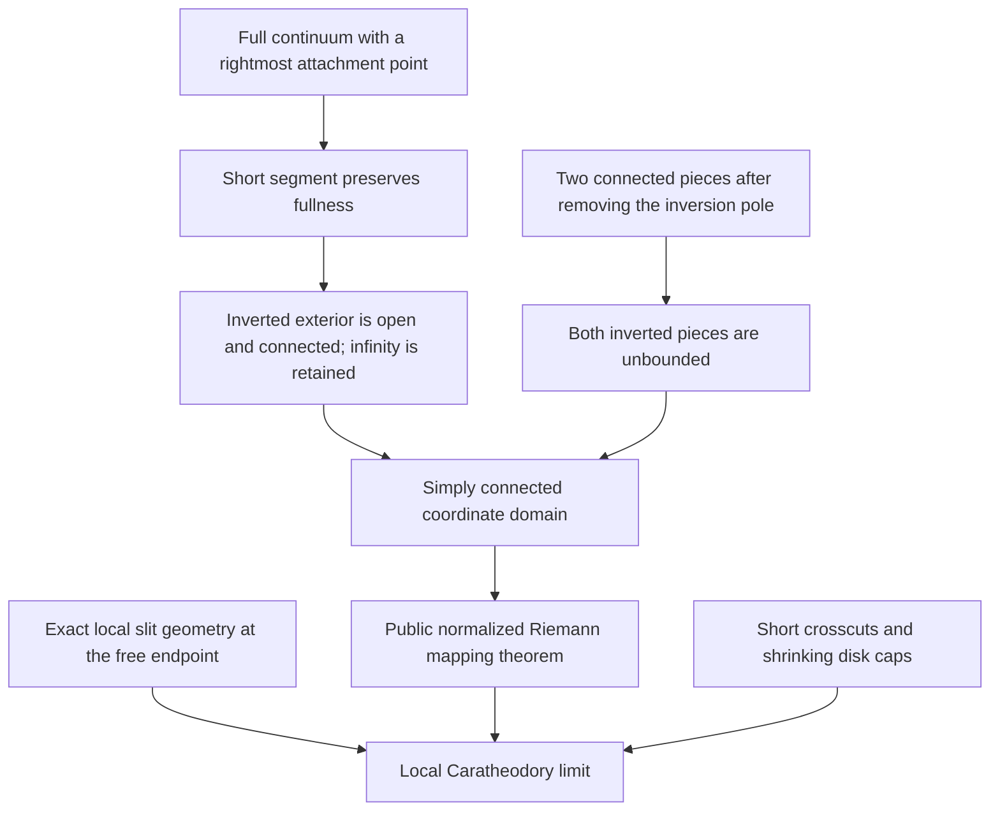
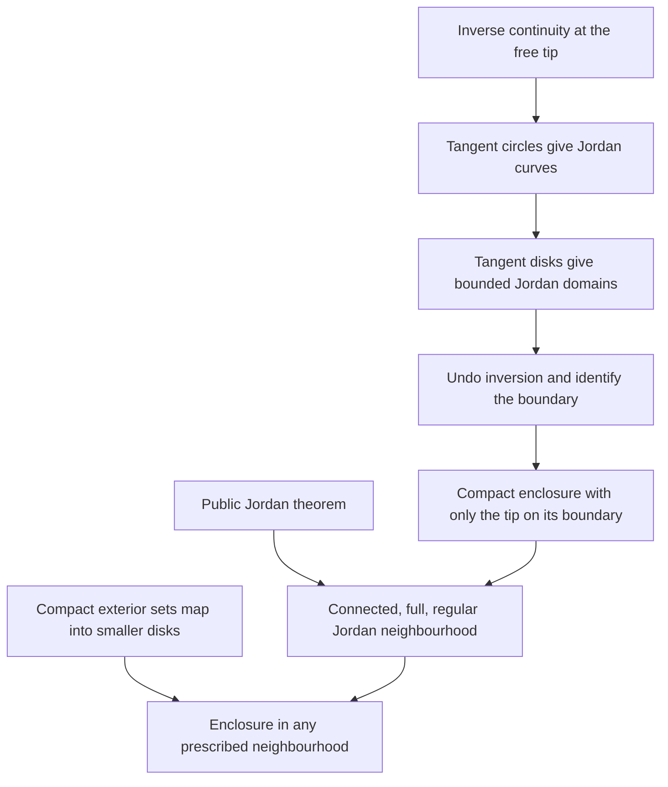

# Exterior-map construction and local Caratheodory continuity

The author suggested replacing the growing filled-domain construction with
the exterior Riemann map of the full continuum X together with a short
attached segment, using local boundary behaviour at its free tip. The initial
analytic and topological stage of this suggestion is now checked in Lean.

## Exact checked statement

After translation, take positive real numbers a and b, assume -a belongs to
the full compact continuum X, and assume Re x <= -a for every x in X. Set
E = X union [-a,b]. Invert about zero, an interior point of the added segment.
The coordinate domain is

    U = {0} union {w : w != 0 and 1/w is not in E}.

Zero in U represents infinity in the original exterior. The theorem
`exists_exterior_map_with_corresponding_slit_tip_limits` constructs a holomorphic bijection
f: U -> unit disk with f(0)=0 and positive real derivative at zero. It proves
that f has a unique limit on the unit circle as w approaches 1/b within U.
This is the original segment's free endpoint. No local connectedness of the
rest of X is assumed. The inverse map also tends to 1/b as its argument
approaches the same circle point from anywhere in the disk. This is a full
within-disk limit, not just convergence along one approach curve.

## Proof route

The local limit proof uses the classical length-area argument and boundary
cluster sets, rather than a formal development of prime ends. A short circular
crosscut has its image in a small boundary cap. Connectedness of the disk
outside that cap traps the entire local approach region. Arbitrarily small
caps imply a singleton cluster set and hence a boundary limit.

## Further local boundary results

FunctionTheory now proves limits along either selected bank of a straight
slit and continuous extension on a closed half-neighbourhood. The checked
`exists_continuous_extension_on_unwrapped_slit` combines these with the tip
limit: after the square coordinate unwraps the slit into a diameter, the disk
map extends continuously over that diameter, with unit-circle values. It
remains holomorphic and injective on the open half-disk. See
[SlitTipUnwrapped](../../FunctionTheory/FunctionTheory/Conformal/SlitTipUnwrapped.lean).

There is also now a general
[spherical Riemann mapping theorem](../../FunctionTheory/docs/RIEMANN_SPHERE.md).
It uses `OnePoint ℂ` with a complex-manifold atlas adapted from Ray and the
unchanged public Tau Ceti plane theorem. The current exterior construction
continues to use its checked inversion-coordinate interface.

## Inverse continuity and tip curves

The local inverse-continuity theorem is proved in
[SlitTipInverse](../../FunctionTheory/FunctionTheory/Conformal/SlitTipInverse.lean).
The proof unwraps the slit, applies Schwarz reflection to a Cayley-normalized
map, takes its local analytic inverse, and squares. The application uses the
separate continuity corollary; it does not need to assume or request a
holomorphic extension.

[SlitTipJordanCurve](../../FunctionTheory/FunctionTheory/Conformal/SlitTipJordanCurve.lean)
extends the inverse continuously and injectively to the disk plus this one
boundary point. Images of internally tangent circles are Jordan curves through
the tip, and every other curve point belongs to the coordinate domain. For
tangent disks containing zero, the curve avoids its image, allowing inversion
back to the original plane.

The two public definitions of Jordan curve are now proved equivalent in
[JordanBoundaryEquivalence](../EremenkosConjecture/JordanBoundaryEquivalence.lean),
so these curves can use the Schoenflies interior/exterior results.

## Compact Jordan enclosure: proved

For every open neighbourhood N of E = X union [-a,b],
[`exists_jordan_enclosure_through_attached_segment_tip`](../EremenkosConjecture/AttachedSegmentJordanEnclosure.lean)
constructs a full, regular compact Jordan neighbourhood L of X such that:

- L is contained in N and contains E;
- every point of E except b lies in the interior of L;
- b lies on the Jordan boundary of L;
- the remaining boundary points lie outside E.

The proof maps internally tangent disks under the continuously extended
inverse, then undoes inversion. The transformed domain is the exterior of a
compact set. Its boundary is the transformed tangent circle. Compactness and
the Jordan theorem identify it with the closed bounded Jordan region, giving
connectedness, fullness and regularity. No plane extension of a conformal map
is used.

For neighbourhood control, invert the complement of N together with infinity.
This is a compact subset of the exterior coordinate domain, whose disk-map
image is contained in a smaller disk. Sufficiently large tangent disks contain
that image, so the resulting compact enclosure lies in N.

## Completed application

The compact enclosure, its joining geometry with the straight tail,
normalization convergence and the adapted Arakelian induction are complete.
Theorem 1.2 is proved; the [construction map](THEOREM12_PLAN.md) records each
step. Proposition 7.6 and further paper results are deferred at the
maintainer's requested stopping point.

The analytic large-modulus estimate for equation (7.3) is already checked;
see [the separating-quadrilateral note](SEPARATING_QUADRILATERAL.md). The full
Theorem 7.1 and explicit counterexample to Eremenko's conjecture remain
unconditional checked results.
