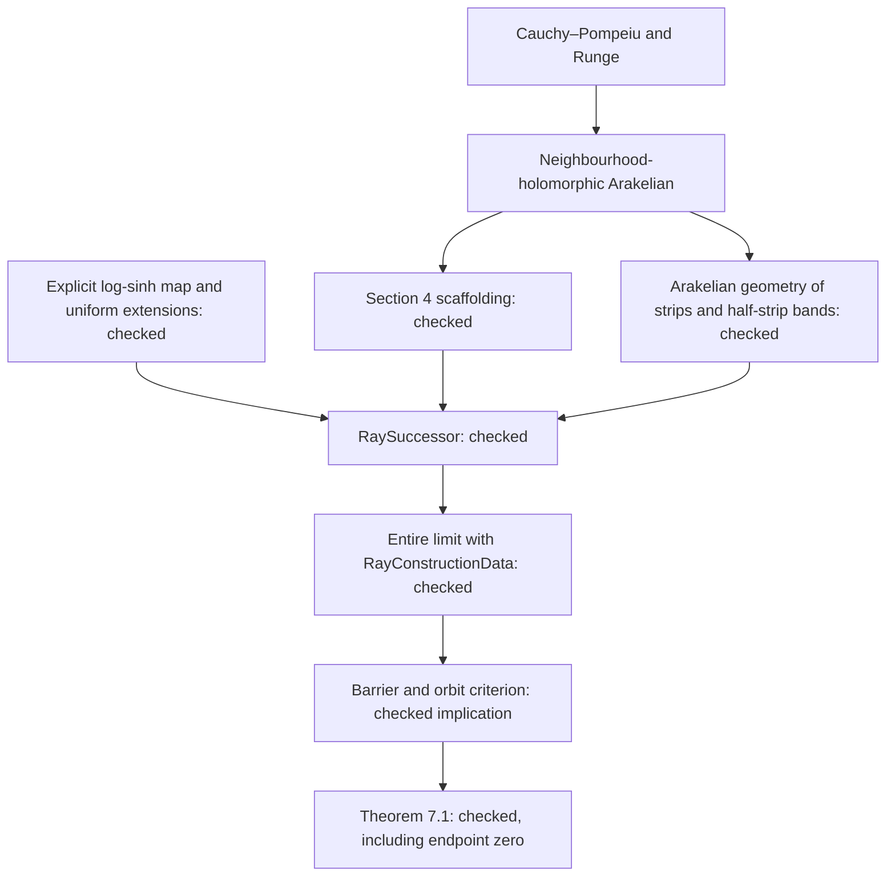

# Section 7: checked counterexample and proof map

Updated 18 September 2026. **Theorems 7.1 and 1.2 are proved.** The exact
ray conclusion has endpoint zero, and the arbitrary-continuum construction
is unconditional. See [Theorem 1.2's detailed map](THEOREM12_PLAN.md) and
[current verification and scope](../STATUS.md).

## Results already checked

| Part of the proof | Lean source | What is established |
| --- | --- | --- |
| Section 4 | [Scaffolding](../EremenkosConjecture/Scaffolding.lean) | Lemma 4.1, the conformal branches and derivative bounds, and an initial entire function with room for further approximation |
| Uniform stability | [UniformConformalStability](../EremenkosConjecture/UniformConformalStability.lean) | Injectivity, image inclusion, derivative bounds, and uniform control on unbounded sets with explicit margins |
| Ambient stability | [UniformAmbientExtension](../EremenkosConjecture/UniformAmbientExtension.lean) | Small perturbations preserve a bi-Lipschitz ambient extension when the image has a uniform margin |
| Explicit half-strip map | [HalfStripControl](../EremenkosConjecture/HalfStripControl.lean) and the sibling approximation library | The map log(sinh z), injectivity, real-axis surjectivity, derivative estimates, endpoint limits, and an ambient extension on closed insets |
| Unbounded fullness | [UnboundedFullness](../EremenkosConjecture/UnboundedFullness.lean) | Closed sets exhausted in a controlled way by full compact pieces have no bounded complementary components |
| Barriers | [ComponentBarriers](../EremenkosConjecture/ComponentBarriers.lean) | Closed barriers identify actual connected components, including singleton components |
| Orbit estimates | [ScaffoldingOrbits](../EremenkosConjecture/ScaffoldingOrbits.lean) | Return-block escape and bungee criteria for the Section 4 schedule |
| Final dynamical implication | [RayCounterexampleCriterion](../EremenkosConjecture/RayCounterexampleCriterion.lean) | **Given** `RayConstructionData`, the ray is Julia, its endpoint escapes, its other points are bungee, the endpoint is a singleton escaping component, and the function is transcendental entire |
| Quantitative stages | [RayStage](../EremenkosConjecture/RayStage.lean) | The induction invariant and its initial instance; RaySuccessor proves a successor for every stage |
| Finite unbounded iterates | [UnboundedIterateStability](../EremenkosConjecture/UnboundedIterateStability.lean) | One uniform approximation tolerance preserves all the required finite iterate extensions on a smaller half-strip |
| Stage approximation geometry | [RayApproximationGeometry](../EremenkosConjecture/RayApproximationGeometry.lean) | The three-piece set is Arakelian and lies in the next expanding background |

The dynamical criterion is an implication. Its construction hypotheses are
now supplied unconditionally by `exists_rayConstructionData` in
[RayCounterexample](../EremenkosConjecture/RayCounterexample.lean).

## Proof map

## Why the restricted approximation theorem fits

The prescribed maps are holomorphic on open neighbourhoods of their closed
pieces. For the half-strip piece, shrink its height and translate the map
slightly towards its interior. This leaves a positive margin both at the
finite endpoint and along the infinite sides. The constant and entire pieces
already extend across their closed sets. Disjoint closed pieces can be glued
on disjoint open neighbourhoods. Thus the neighbourhood version of Arakelian
is the appropriate approximation input; interior holomorphy alone is not being
used as a substitute for this stronger hypothesis.

The explicit half-strip map avoids a Schwarz-reflection dependency for this
part of Theorem 7.1. No general statement of Lemma 7.2 has been claimed.

## Why ambient extensions reappear here

Fullness of compact sets under domain homeomorphisms was proved independently
in ComplexApproximation and does not require an ambient extension. The new
extensions serve a different purpose: transporting **unbounded** Arakelian
sets and retaining uniform neighbourhood widths throughout the induction.
Only the particular maps and sufficiently small perturbations considered here
are extended; no arbitrary conformal-map extension theorem is asserted.

## Theorem 1.2 and the stopping point

The general-continuum branch uses the exterior map at the free attached tip,
the uniform whole-continuum estimate, local iterate charts and their positive
margins, actual Arakelian approximation, and a summable limit. Every input to
`ContinuumConstructionData.conclusions` is supplied by
`exists_continuumConstructionData_normalized`. Affine normalization gives
`theorem1_2` for the original continuum. The complete file-by-file explanation
is in [THEOREM12_PLAN.md](THEOREM12_PLAN.md).

Proposition 7.6 and further paper results are deferred. No claim of a full
formalisation of the paper is made. The selected counterexamples and Theorem
1.2 have a [Palomar-style statement surface](../Challenge.lean).
