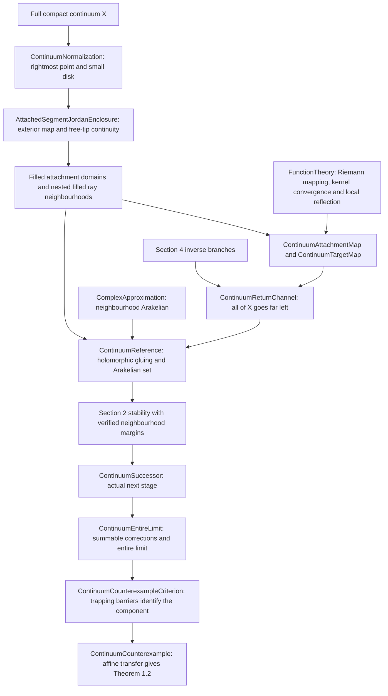

# Theorem 1.2: completed proof

[Exact final theorem](../EremenkosConjecture/ContinuumCounterexample.lean) · [Statement gallery](../EremenkosConjecture/MainTheorems.lean) · [All modules](MODULE_INDEX.md)

Every nonempty full compact connected set X in the plane is **exactly a
connected component** of the escaping set of some transcendental entire f.
There is no construction witness, regularity of the boundary, or normalization
assumption in the final statement `EremenkosConjecture.theorem1_2`.

## Geometry and the whole-continuum estimate

The continuum is shrunk and translated so that a rightmost point is the base
of an attached horizontal ray. An exterior Riemann map and inverse continuity
at the free slit tip give the required enclosing Jordan curve. The remaining
boundary of X need not be locally connected.

Filled attachment domains have an exact shrinking-channel kernel and straight
tails. The length-area separation argument forces the **whole continuum** far
to the left under the normalized strip map. It uses the author's large-modulus
hint; interior kernel convergence by itself was not substituted for (7.3).
The same target map compresses a prescribed finite segment of the ray.

| Geometric step | Main source |
| --- | --- |
| Exterior map, local inverse continuity and Jordan enclosure at the attached tip | [AttachedSegmentJordanEnclosure](../EremenkosConjecture/AttachedSegmentJordanEnclosure.lean) |
| Actual maps on shrinking filled domains and uniform escape | [FilledAttachmentEscape](../EremenkosConjecture/FilledAttachmentEscape.lean) |
| One map with continuum escape and finite-ray compression | [ContinuumTargetMap](../EremenkosConjecture/ContinuumTargetMap.lean) |
| Strictly nested neighbourhoods with exact intersection X union ray | [NestedFilledRayNeighbourhoods](../EremenkosConjecture/NestedFilledRayNeighbourhoods.lean) |
| Connected open insets, common straight tail and positive margins | [ContinuumRegionGeometry](../EremenkosConjecture/ContinuumRegionGeometry.lean) |

## Approximation and persistence

`ContinuumReturnChannel` joins the target map to Section 4 inverse branches.
`ContinuumReference` glues the old entire function, a constant barrier map,
and the return map on separated pieces. Its actual control set is proved
Arakelian, and the reference is holomorphic on a neighbourhood of it. Thus
the proved neighbourhood version of Arakelian suffices throughout.

The barrier's reference iterate is zero. Lemma 2.5 keeps its approximating
iterate inside the trapping disk. The same finite-iterate estimate, together
with the Section 2 injectivity result, preserves the charts on smaller
neighbourhoods. Every required uniform margin is supplied by the geometry.
No new general approximation theorem is assumed.

| Inductive step | Main source |
| --- | --- |
| Return map, its charts and all-X escape bounds | [ContinuumReturnChannel](../EremenkosConjecture/ContinuumReturnChannel.lean) |
| Gluing, actual Arakelian control set and entire approximation | [ContinuumReference](../EremenkosConjecture/ContinuumReference.lean) |
| Exact reference orbits and margins | [ContinuumReferenceOrbits](../EremenkosConjecture/ContinuumReferenceOrbits.lean) |
| Barrier remains trapped by Lemma 2.5 | [ContinuumBarrierStability](../EremenkosConjecture/ContinuumBarrierStability.lean) |
| Iterate charts and approximation tolerances | [ContinuumReferenceCharts](../EremenkosConjecture/ContinuumReferenceCharts.lean), [ContinuumApproximationCharts](../EremenkosConjecture/ContinuumApproximationCharts.lean) |
| Common tolerance for all finitely many constraints | [ContinuumApproximationStability](../EremenkosConjecture/ContinuumApproximationStability.lean) |
| Existence of a successor with a halved reserve | [ContinuumSuccessor](../EremenkosConjecture/ContinuumSuccessor.lean) |

## Limit and exact component

The corrections are summable on an exhaustion of the plane. The limit is
entire and stays within each stage's remaining reserve, retaining every
trapping and orbit condition. All points of X escape; points of the attached
ray outside X have bounded returns and unbounded excursions. Nested trapped
frontiers prevent any connected escaping set from leaving X. Bounded values
along an unbounded frontier sequence rule out a polynomial limit. Affine
conjugacy then returns the component to the exact original X.

The final assembly is in [ContinuumCounterexample](../EremenkosConjecture/ContinuumCounterexample.lean).
The criterion in [ContinuumCounterexampleCriterion](../EremenkosConjecture/ContinuumCounterexampleCriterion.lean)
is conditional as a reusable lemma; all its data are now constructed.

Mathematical development stops at this theorem as requested. Proposition 7.6
and the remaining paper results are deferred; see [STATUS](../STATUS.md).
