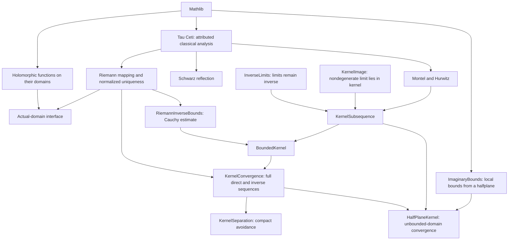
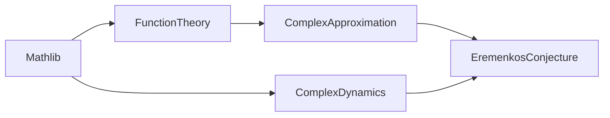
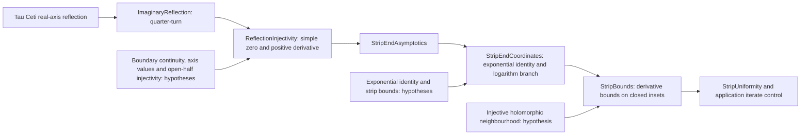
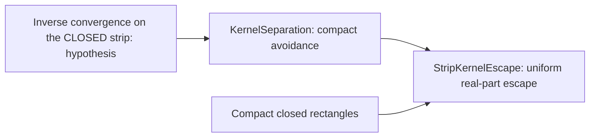
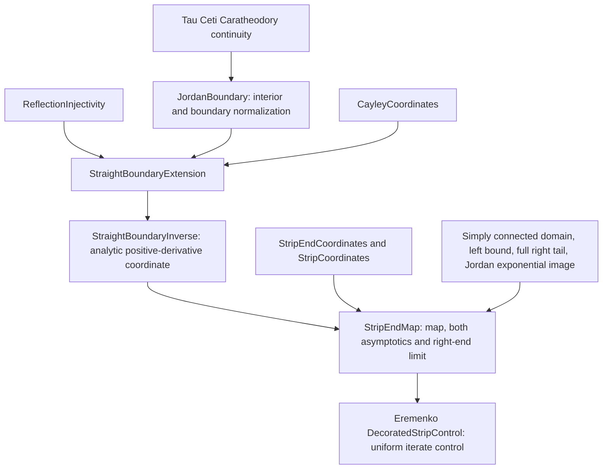
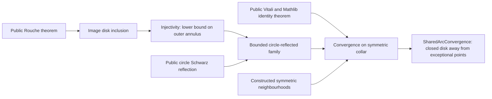
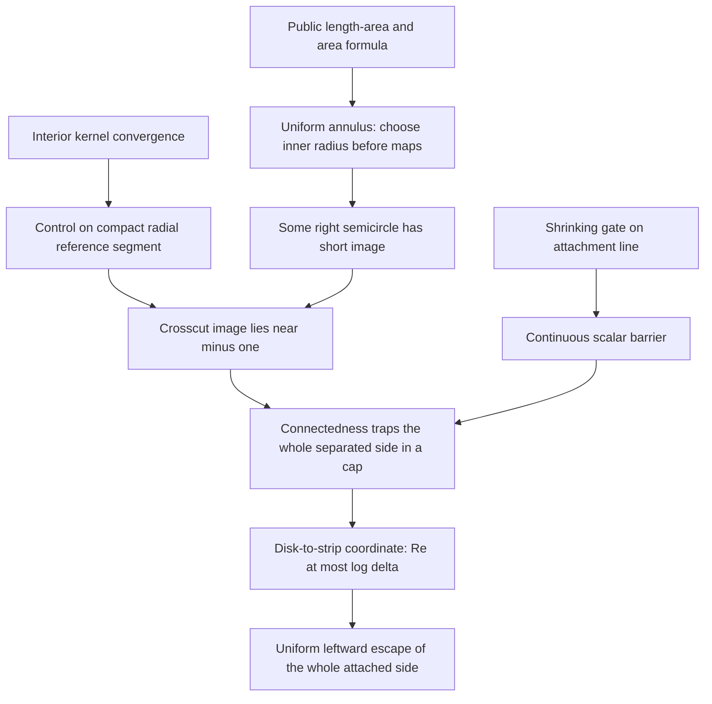
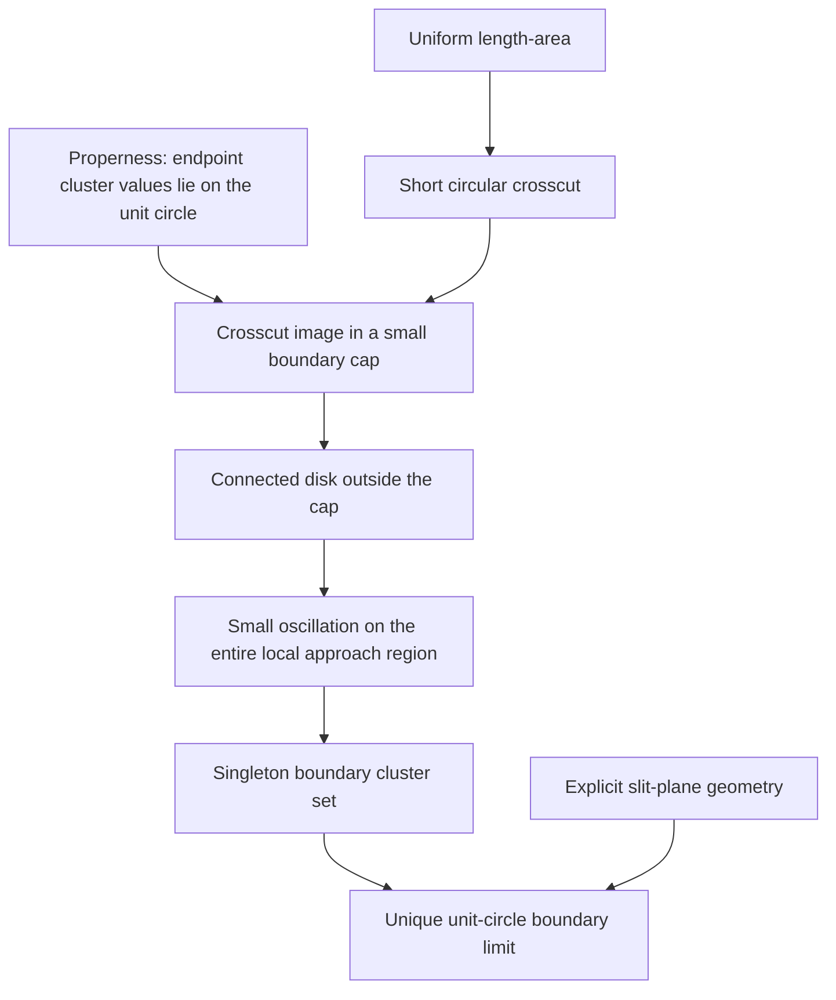
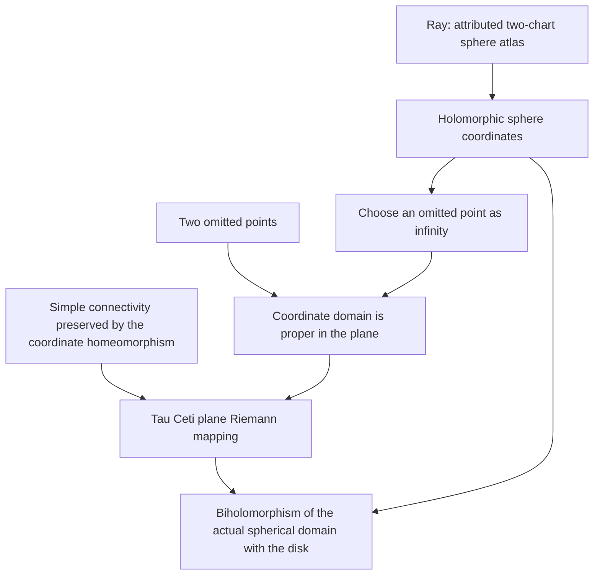
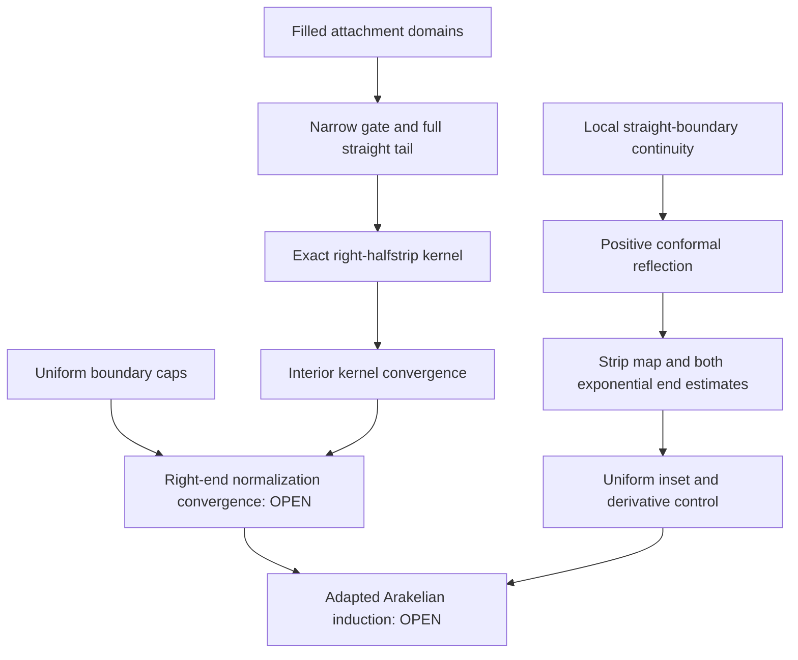

# Proof map

[Main results](MAIN_RESULTS.md) · [Complete module index](docs/MODULE_INDEX.md)

The last compact-avoidance statement is a general convergence lemma, also
usable independently. The diagram describes the mathematical proof route;
the generated [JSON graph](docs/import-graph.json) records exact direct imports.
Tau Ceti's 138 source modules are listed separately in its
[upstream manifest](third_party/TauCeti/UPSTREAM.json).

## Relationship between projects

The Eremenko Theorem 7.1 proof uses explicit maps and approximation. Importing
the conformal foundations into an umbrella module does not make them necessary
dependencies of that theorem's mathematical argument. The general-continuum
Theorem 1.2, now proved in EremenkosConjecture, applies the additional conformal machinery.

## Strip-end estimates

The geometric application must supply the boundary continuity, axis values,
halfplane mapping property and exponential identity used by these analytic
results. The general geometric assertion of Lemma 7.2 is not yet completed.

## Whole-set escape from boundary convergence

This reduction identifies the boundary-convergence input still missing in the
general-continuum application. Open-strip convergence alone is insufficient.

## Geometric boundary normalization: checked

The geometric assumptions in G are explicit. This route supplies the
reflection data previously left as analytic inputs. The decorated-domain
construction and uniform whole-continuum estimate still remain open.

`StripEndMap` also feeds into
[StripProper](FunctionTheory/Conformal/StripProper.lean): compact left
truncations plus the translation asymptotic give bounded displacement, hence
properness on a closed inset and a closed image. This supplies a topological
property needed when transporting the unbounded approximation sets.

[The compact-subset loop criterion](FunctionTheory/Topology/SimpleConnectivity.lean)
is independent of the conformal-map development. The application combines it
with filled compacta and its attributed Jordan–Schoenflies dependency.

The boundary-injectivity route is now included:
`Topology/BoundaryApproach` supplies chart transfer, while the unchanged public
`Inverse/BoundaryCluster` theorem supplies injectivity. The application combines
these with Schoenflies to obtain Carathéodory's closure homeomorphism.

## Convergence across a shared boundary arc

The shared-arc condition must be proved for the varying domains in the
application. The theorem does not infer it from open-disk convergence alone.

## The separating quadrilateral route

The source half-annulus is a quadrilateral of large modulus. Length-area
provides precisely its short-crosscut consequence. The theorem consumes
explicit domain and kernel hypotheses; the paper-specific construction is
still an application obligation.

## Local Caratheodory at a slit tip

Only local geometry at the selected boundary point is used. The exterior-map
application and its checked compact enclosure construction are described in the sibling
[application note](../EremenkosConjecture/docs/LOCAL_CARATHEODORY.md).

## Riemann mapping on the sphere

The sphere coordinate is explicit, so this does not require a general
uniformization theorem for Riemann surfaces. See the
[exact statement](docs/RIEMANN_SPHERE.md).

## Local boundary geometry and the actual kernel

The compact Jordan enclosure through the free attached-segment tip is also
proved in every prescribed neighbourhood. The new strip-map theorem does not
require the exponential image to have Jordan boundary.
