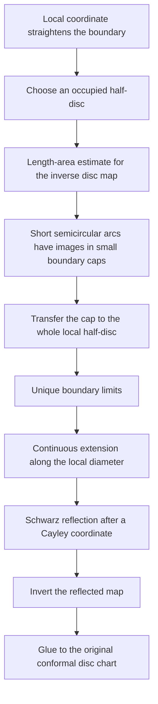

# Local reflection at an analytic boundary arc

The public result is
[`exists_disc_continuation_at_regular_analytic_boundary`](../FunctionTheory/Conformal/LocalAnalyticBoundaryContinuation.lean).
If a conformal map sends the disc onto an open plane domain U and p is a
regular analytic point of its boundary, the map has an analytic continuation
to the disc together with a small ball about some unit-circle point xi. The
continuation sends xi to p and is injective on that small ball.

No global Jordan boundary or continuity on the whole closed disc is assumed.
The domain can occupy both sides of the arc, as at a slit. In that situation
global injectivity of the continuation on the union need not hold; local
injectivity is the conclusion used in the wandering-domain boundary proof.

## Proof map

The cap transfer uses a closed half-disc image and signed distance to it.
It therefore does not extend the local coordinate to a homeomorphism of the
plane. Boundary limits along the diameter are obtained by translating that
same local coordinate; no prime-end theorem is assumed.

## Modules

- [BoundaryCapTransfer](../FunctionTheory/Conformal/BoundaryCapTransfer.lean):
  signed-distance transfer and short-arc cap selection.
- [AnalyticHalfDiscBoundary](../FunctionTheory/Conformal/AnalyticHalfDiscBoundary.lean):
  the relevant boundary of the local piece is its semicircle.
- [AnalyticSideCap](../FunctionTheory/Conformal/AnalyticSideCap.lean),
  [AnalyticSideLimit](../FunctionTheory/Conformal/AnalyticSideLimit.lean), and
  [AnalyticSideContinuous](../FunctionTheory/Conformal/AnalyticSideContinuous.lean):
  cap control, unique limits and continuous local extension.
- [AnalyticBoundarySide](../FunctionTheory/Conformal/AnalyticBoundarySide.lean):
  at least one local side belongs to the domain; both are allowed.
- [AnalyticSideInverse](../FunctionTheory/Conformal/AnalyticSideInverse.lean):
  invert the reflected inverse disc map.
- [LocalAnalyticBoundaryContinuation](../FunctionTheory/Conformal/LocalAnalyticBoundaryContinuation.lean):
  the domain-level statement and analytic gluing.

The proof builds on the attributed Tau Ceti conformal-map and cluster-set
library and the previously checked length-area and Schwarz-reflection results
in this project. It introduces no boundary-extension assumption in place of
the requested conclusion.
