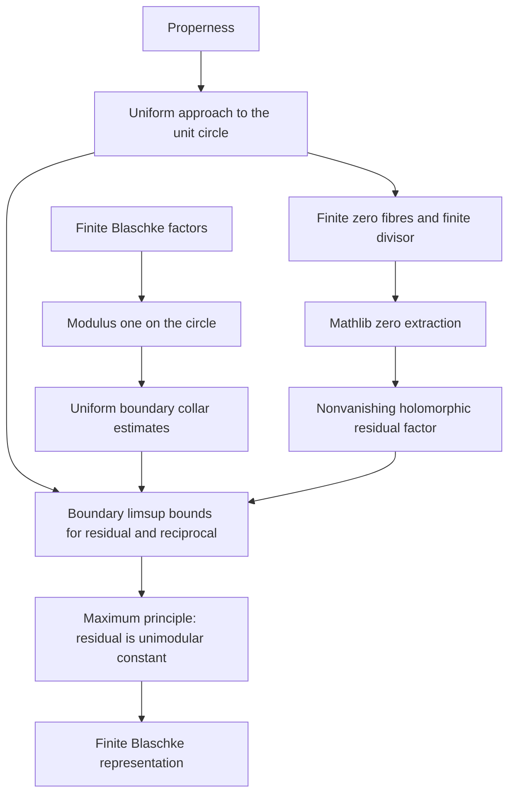

# Proper holomorphic maps of the disc

A holomorphic map from the open unit disc to itself is proper if inverse
images of compact sets are compact. Every such map is a finite Blaschke
product of positive degree:

    f(z) = c ∏ (z − a_j) / (1 − conjugate(a_j) z),
    |c| = 1, |a_j| < 1.

Zeros are repeated according to multiplicity. The original map is required
to be holomorphic only on the open disc; no continuous boundary extension
is assumed. The rational representation supplies such an extension.

## Formal statements

- [ProperDiscBlaschke](../FunctionTheory/Conformal/ProperDiscBlaschke.lean):
  `exists_finiteBlaschkeProduct_of_isProperMap_holomorphic_disc` uses the
  existing `FiniteBlaschkeProduct` structure. The companion weighted form
  lists distinct zeros with positive multiplicities.
- [ProperDiscQuotient](../FunctionTheory/Conformal/ProperDiscQuotient.lean):
  a zero-free residual factor is a unimodular constant.

The full build, source-integrity scan and all 592 selected axiom reports
have passed. Only propext, Classical.choice and Quot.sound occur.

## Proof map

The zero extraction reuses Mathlib's `MeromorphicOn.extract_zeros_poles`;
it is not a new proof of that general factorisation theorem. The collar
and boundary-limsup interfaces and their assembly were developed here.

## Remaining use in WanderingDynamics

[BlaschkeUnicritical](../FunctionTheory/Conformal/BlaschkeUnicritical.lean)
now proves the consequence used by the manuscript: a proper holomorphic
disc map fixing its unique critical point at zero is `c*z^d`, with `|c|=1`
and `d≥2`. The original map need only be holomorphic on the open disc.

The finite Blaschke representation has positive angular derivative on the
circle. Its quotient `B/(z*B')` has a removable singularity at zero and no
other denominator zero in the closed disc. Its real part is positive on
the circle, hence throughout the disc by applying the maximum principle
to `exp(-g)`. Any additional zero of B would contradict that positivity.
All Blaschke zeros are consequently zero. This avoids a separate count
of critical points or an argument-principle proof.

[UnicriticalCharts](../FunctionTheory/Conformal/UnicriticalCharts.lean) now
proves the change to arbitrary conformal charts, with properness on actual
source and target domains. The general
local reflection statement without closed-disc continuity is separately
outstanding.

Public reconnaissance included the pinned Tau Ceti and EPFL trees, the
selected public Sullivan project, and searches for other-prover precedents.
No directly reusable proper-disc classification proof was identified in
that reconnaissance; this is not a claim that no such proof exists.
